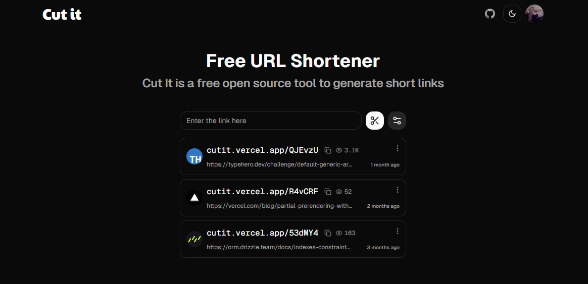

# [Cut It](https://cutit.vercel.app/)

[](https://cutit.vercel.app/)

Cut It is a free open source tool to generate short links
. With a user-friendly interface and robust functionality, Cut It makes it easy to share and manage shortened links.

This project inspired by [Dub](https://dub.co).

## Features

- **URL Shortening:** Easily shorten long URLs with a click.
- **Customizable URLs:** Customize the shortened URLs to your preference.
- **User-Friendly Interface:** Intuitive and easy-to-use interface for quick link management.
- **Analytics:** Track link analytics and statistics. (soon)

## Technologies Used

- **Framework**: [Next.js](https://nextjs.org/)
- **Database**: [Turso](https://turso.tech/)
- **ORM**: [Drizzle](https://orm.drizzle.team/)
- **Authentication**: [NextAuth.js](https://next-auth.js.org/)
- **Redis**: [Upstash](https://upstash.com/)
- **Styling:** [Tailwind CSS](https://tailwindcss.com)
- **UI Components**: [Shadcn-ui](https://tailwindcss.com/)
- **Deployment**: [Vercel](https://vercel.com)

## Running Locally

1. Clone the repository

   ```bash
   git clone https://github.com/mehrabmp/cut-it
   ```

2. Install dependencies using pnpm

   ```bash
   pnpm install
   ```

3. Copy the `.env.example` to `.env` and update the variables.

   ```bash
   cp .env.example .env
   ```

4. Start the development server

   ```bash
   pnpm run dev
   ```

5. Push the database schema

   ```bash
   pnpm run db:push
   ```

## How do I deploy this?

Follow the deployment guides for [Vercel](https://create.t3.gg/en/deployment/vercel) and [Docker](https://create.t3.gg/en/deployment/docker) for more information.

## Contributing

Contributions are welcome! Please open an issue if you have any questions or suggestions. Your contributions will be acknowledged. See the [contributing guide](./CONTRIBUTING.md) for more information.

## License

Licensed under the MIT License. Check the [LICENSE](./LICENSE) file for details.
